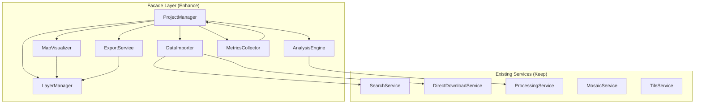

# UML Alignment Plan for SATI Project

## Executive Summary
This document outlines the plan to align the SATI backend implementation with the requirements specified in `uml.mermaid` while preserving and expanding all existing functionality. The goal is to satisfy ALL UML requirements without removing any of the advanced features already implemented.

## Alignment Principles
1. **Preserve Everything**: No existing functionality will be removed
2. **Expand Intelligently**: Add missing UML methods while leveraging existing services
3. **Maintain Cohesion**: Ensure facade classes properly orchestrate existing services
4. **API Consistency**: All new methods must be exposed through RESTful endpoints

## Architecture Strategy

### Current State
- **API-First**: RESTful endpoints with FastAPI
- **Service-Oriented**: Separate services for each domain
- **Job Queue**: Asynchronous processing via ARQ/Redis
- **Advanced Features**: Processing, Mosaics, Downloads, Tiles

### Target State
- **Facade + API**: ProjectManager as orchestrator while maintaining API endpoints
- **Rich Domain Models**: Proper Layer, MapView, MetricsReport classes
- **Hybrid Architecture**: Facade pattern for complex operations, direct services for simple ones
- **Full UML Compliance**: All methods from UML implemented (actual or intelligent mocks)

## Implementation Phases

### Phase 1: Data Models (Foundation)
Enhance existing domain models in `app/api/v1/features/projects/models.py`.

**Current State vs Target State:**

| Model | Current Properties | Required Properties (from UML) | Action |
|-------|-------------------|--------------------------------|--------|
| Layer | id, name, data | id, name, type, crs, visible, opacity, metadata | Add missing properties |
| MapView | layers, base_map | layers, base_map | ✅ Complete |
| MetricsReport | metrics | avg_response_time, total_requests, errors, additional_metrics | Enhance structure |

**Layer Model Enhancement Required:**
```python
class Layer(BaseModel):
    id: str
    name: str
    type: str  # 'raster', 'vector', 'index', 'composite'
    crs: str = 'EPSG:4326'
    visible: bool = True
    opacity: float = 1.0
    metadata: Dict[str, Any]
    data: Dict  # Keep for backward compatibility
```

**MetricsReport Model Enhancement Required:**
```python
class MetricsReport(BaseModel):
    avg_response_time: float
    total_requests: int
    errors: int
    additional_metrics: Dict[str, Any]
    metrics: List[Dict]  # Keep for backward compatibility
```

### Phase 2: ProjectManager Enhancement
Transform ProjectManager from simple CRUD to full orchestrator.

| Method | Implementation Strategy | Uses Services |
|--------|------------------------|---------------|
| `load_local_data(file_path) -> Layer` | Read local raster/vector files, convert to Layer | DataImporter, Processing |
| `search_and_import_rasters(aoi, filters) -> List[Layer]` | Search STAC, import as Layers | SearchService, STACClient |
| `visualize_layers() -> MapView` | Create map view with all layers | MapVisualizer, LayerManager |
| `perform_analysis(expression, layers) -> Layer` | Execute analysis, return result as Layer | AnalysisEngine, ProcessingService |
| `export_project(output_path)` | Serialize project state to file | ExportService |
| `load_project(project_path)` | Deserialize project from file | ExportService |
| `collect_metrics() -> MetricsReport` | Aggregate performance data | MetricsCollector |

### Phase 3: LayerManager Completion

| Method | Implementation Strategy | Integration |
|--------|------------------------|-------------|
| `set_crs(layer_id, crs)` | Transform layer CRS using rasterio/geopandas | ProcessingService |
| `toggle_visibility(layer_id, visible)` | Update layer visibility flag | Internal state |
| `reorder_layers(order)` | Reorder layers list | Internal state |
| `set_opacity(layer_id, opacity)` | Update layer opacity | Internal state |

### Phase 4: DataImporter Enhancement

| Method | Implementation Strategy | Integration |
|--------|------------------------|-------------|
| `load_local(file_path) -> Layer` | Load local files (GeoTIFF, Shapefile, etc.) | Use rasterio/geopandas |
| `search_online(aoi, filters) -> List[Layer]` | Wrap SearchService results as Layers | SearchService |
| `download_raster(url) -> Layer` | Download and convert to Layer | DirectDownloadService |

### Phase 5: MapVisualizer Enhancement

| Method | Implementation Strategy | Integration |
|--------|------------------------|-------------|
| `render_map(layers) -> MapView` | Generate interactive map | Folium/Leaflet |
| `add_basemap(provider)` | Add basemap layer | Tile providers |
| `zoom_to_layer(layer)` | Calculate and set map bounds | Layer bbox |

### Phase 6: AnalysisEngine Implementation

| Method | Implementation Strategy | Integration |
|--------|------------------------|-------------|
| `calculate(expression, layers) -> Layer` | Band math and calculations | ProcessingService |
| `clip_raster_by_aoi(raster, aoi) -> Layer` | Spatial clipping | ProcessingService |
| `measure_distance(geom1, geom2, unit) -> float` | Geometric calculations | GeoPandas |

### Phase 7: ExportService Completion

| Method | Implementation Strategy | Integration |
|--------|------------------------|-------------|
| `export_layer(layer, format) -> File` | Export to various formats | GDAL/OGR |
| `save_project(project) -> Path` | Serialize project state | JSON/Pickle |
| `load_project(path) -> Project` | Deserialize project | JSON/Pickle |

### Phase 8: MetricsCollector Enhancement

| Method | Implementation Strategy | Integration |
|--------|------------------------|-------------|
| `collect_performance_data() -> MetricsReport` | Aggregate timing and resource metrics | Redis metrics |
| `log_error(event)` | Error tracking | Logging system |
| `generate_report() -> Dict` | Already implemented | Existing |

## API Endpoint Mapping

### Existing Endpoints (Keep)
- `GET /api/v1/projects/` - List projects
- `POST /api/v1/projects/` - Create project
- `POST /api/v1/downloads/export` - Export data
- All processing, mosaic, search endpoints

### New Endpoints (Add)
| Endpoint | Method | Purpose |
|----------|--------|---------|
| `/api/v1/projects/{id}/layers` | GET | List project layers |
| `/api/v1/projects/{id}/layers` | POST | Add layer to project |
| `/api/v1/projects/{id}/layers/{layer_id}` | PATCH | Update layer properties |
| `/api/v1/projects/{id}/layers/{layer_id}` | DELETE | Remove layer |
| `/api/v1/projects/{id}/analysis` | POST | Perform analysis |
| `/api/v1/projects/{id}/visualize` | GET | Get map visualization |
| `/api/v1/projects/{id}/export` | POST | Export project |
| `/api/v1/projects/import` | POST | Import project |
| `/api/v1/projects/{id}/metrics` | GET | Get project metrics |

## Implementation Priority

### Priority 1: Core Functionality (Week 1)
1. Create domain models (Layer, MapView, MetricsReport)
2. Implement ProjectManager orchestration methods
3. Complete LayerManager methods
4. Create basic API endpoints

### Priority 2: Import/Export (Week 2)
1. DataImporter local file support
2. ExportService full implementation
3. Project serialization/deserialization

### Priority 3: Analysis & Visualization (Week 3)
1. AnalysisEngine calculations
2. MapVisualizer enhancements
3. Integration with ProcessingService

### Priority 4: Metrics & Polish (Week 4)
1. MetricsCollector enhancements
2. Error handling improvements
3. Documentation updates

## Mock vs Real Implementation Strategy

### Real Implementations (Priority)
- All ProjectManager methods (orchestrator role)
- LayerManager state management
- DataImporter (leverages existing services)
- Basic AnalysisEngine (uses ProcessingService)

### Intelligent Mocks (Initial)
- Complex MapVisualizer features (can return simple HTML initially)
- Advanced AnalysisEngine algorithms (delegate to ProcessingService)
- Some ExportService formats (start with GeoJSON/TIFF)

## Testing Strategy

### Unit Tests
- Each facade class method
- Domain model validation
- Service integration points

### Integration Tests
- ProjectManager orchestration flows
- API endpoint functionality
- Service communication

### End-to-End Tests
- Complete project lifecycle
- Import → Process → Analyze → Export

## Migration Considerations

### Database Schema
- May need tables for persistent project state
- Layer metadata storage
- User project associations

### Backwards Compatibility
- All existing endpoints remain unchanged
- New functionality is additive only
- Gradual migration path for frontends

## Success Criteria

1. ✅ All UML methods exist (implemented or mocked)
2. ✅ No existing functionality removed
3. ✅ ProjectManager properly orchestrates services
4. ✅ Rich domain models replace dictionaries
5. ✅ API endpoints for all facade operations
6. ✅ Tests pass for all implementations
7. ✅ Documentation updated

## Risk Mitigation

| Risk | Mitigation |
|------|------------|
| Breaking existing features | Comprehensive test suite before changes |
| Performance degradation | Profile facade overhead, optimize hot paths |
| Complex integration | Incremental implementation with feature flags |
| Frontend compatibility | Version API, maintain v1 compatibility |

## Next Steps

1. Review and approve this plan
2. Create domain models
3. Begin ProjectManager enhancement
4. Implement in priority order
5. Test each phase thoroughly
6. Update documentation

## Appendix: Service Dependencies



## Integration with Extended Processing Features

The `uml_extended.mermaid` defines additional processing capabilities that are already implemented. These must be properly integrated with the facade layer:

### ProcessingService Integration
- Already fully implemented with spectral indices, classification, zonal stats
- ProjectManager's `perform_analysis()` will orchestrate ProcessingService
- AnalysisEngine will delegate complex operations to ProcessingService

### Key Processing Features to Preserve
1. **Spectral Indices**: NDVI, NDWI, EVI, SAVI, NDBI, BAI, MNDWI, GNDVI, NDSI, NBR
2. **Classification**: K-means, Random Forest, SVM, Maximum Likelihood, ISODATA
3. **Zonal Statistics**: Mean, min, max, std, median, percentiles
4. **Change Detection**: Between scenes temporal analysis
5. **Time Series**: Temporal composites and trend analysis
6. **Band Math**: Custom expressions
7. **Mask Extraction**: Cloud, water, vegetation masks

### Facade-Processing Bridge
```
ProjectManager.perform_analysis()
    → AnalysisEngine.calculate()
        → ProcessingService.run_analysis()
            → IndexCalculator/Classification/ZonalStatistics
```

### MosaicService and TileService Integration

These existing services will be orchestrated through the facade layer:

**MosaicService Integration:**
- ProjectManager will use MosaicService when combining multiple scenes
- New method: `ProjectManager.create_mosaic(scene_ids, options) → Layer`
- Delegates to `MosaicService.create_mosaic()` and tracks job status

**TileService Integration:**
- MapVisualizer will use TileService for dynamic tile generation
- Enhanced method: `MapVisualizer.render_map()` will optionally generate tiles
- Provides tile URLs for web map rendering

```
ProjectManager.visualize_layers()
    → MapVisualizer.render_map()
        → TileService.generate_tiles() [if web rendering]
        → LayerManager.get_visible_layers()
```

## Authentication Alignment

The UML specifies AuthService methods that are already implemented:

| Method | Current State | Location | Action Required |
|--------|--------------|----------|-----------------|
| `authenticate_user(LoginRequest) → TokenResponse` | ✅ Implemented | `authentication/service.py:44` | Verify return type |
| `create_api_key(user_id, ApiKeyRequest) → ApiKeyResponse` | ✅ Implemented | `authentication/service.py:63` | None |
| `get_user_profile(user_id) → UserProfile` | ✅ Implemented | `authentication/service.py:85` | None |

## Concrete Implementation Examples

### Example: ProjectManager.perform_analysis Implementation
```python
async def perform_analysis(self, expression: str, layers: List[Layer]) -> Layer:
    """Execute analysis expression on layers, returning result as new Layer."""
    # Delegate to AnalysisEngine
    analysis_result = await self.analysis_engine.calculate(expression, layers)

    # If complex processing needed, use ProcessingService
    if self._requires_processing(expression):
        job = await self.processing_service.create_job(
            operation_type="band_math",
            parameters={"expression": expression, "layers": layers}
        )
        result = await self._wait_for_job(job.id)

    # Convert result to Layer
    return Layer(
        id=str(uuid4()),
        name=f"Analysis: {expression[:30]}",
        type="processed",
        metadata={"expression": expression, "source_layers": [l.id for l in layers]},
        data=result.data
    )
```

### Example: LayerManager.set_crs Implementation
```python
def set_crs(self, layer_id: str, target_crs: str) -> None:
    """Transform layer to target CRS."""
    layer = self._get_layer(layer_id)

    if layer.type == "raster":
        # Use rasterio for raster reprojection
        transformed_data = self._reproject_raster(layer.data, layer.crs, target_crs)
    elif layer.type == "vector":
        # Use geopandas for vector reprojection
        transformed_data = self._reproject_vector(layer.data, layer.crs, target_crs)

    layer.crs = target_crs
    layer.data = transformed_data
    layer.metadata["crs_transformed"] = True
```

## Validation Checklist

### UML Requirements Coverage
- [ ] All ProjectManager methods from UML
- [ ] All LayerManager methods from UML
- [ ] All DataImporter methods from UML
- [ ] All MapVisualizer methods from UML
- [ ] All AnalysisEngine methods from UML
- [ ] All ExportService methods from UML
- [ ] All MetricsCollector methods from UML
- [ ] All AuthService methods from UML ✅
- [ ] All SearchService methods from UML ✅
- [ ] All STACClient methods from UML ✅

### Implementation Quality
- [ ] Models match UML specifications
- [ ] Methods have proper return types
- [ ] Integration with existing services
- [ ] API endpoints for facade operations
- [ ] Error handling in place
- [ ] Tests for new functionality

### Backward Compatibility
- [ ] No existing endpoints removed
- [ ] No existing services broken
- [ ] Frontend compatibility maintained
- [ ] Database migrations safe

## Consensus Validation Results

**Confidence Score: 9/10** - The plan successfully bridges the UML requirements with the existing advanced implementation.

### Strengths Identified:
1. **Wrap-not-replace strategy** - Preserves all existing investments while adding structure
2. **Phased approach** - Manages complexity through incremental implementation
3. **Backward compatibility** - Ensures smooth transition without breaking changes
4. **Comprehensive coverage** - Addresses all UML requirements systematically
5. **Practical implementation** - Concrete examples demonstrate feasibility

### Key Recommendation:
The plan represents the optimal approach for aligning the implementation with UML requirements while preserving and enhancing the existing advanced features. The facade pattern provides necessary orchestration without sacrificing the power of the current service-oriented architecture.

## Version History

- v1.0 - Initial alignment plan
- v1.1 - Added integration with extended processing features and auth alignment
- v1.2 - Enhanced model specifications and verified existing implementations
- v1.3 - Added concrete implementation examples and validation checklist
- v1.4 - Added MosaicService/TileService integration and consensus validation
