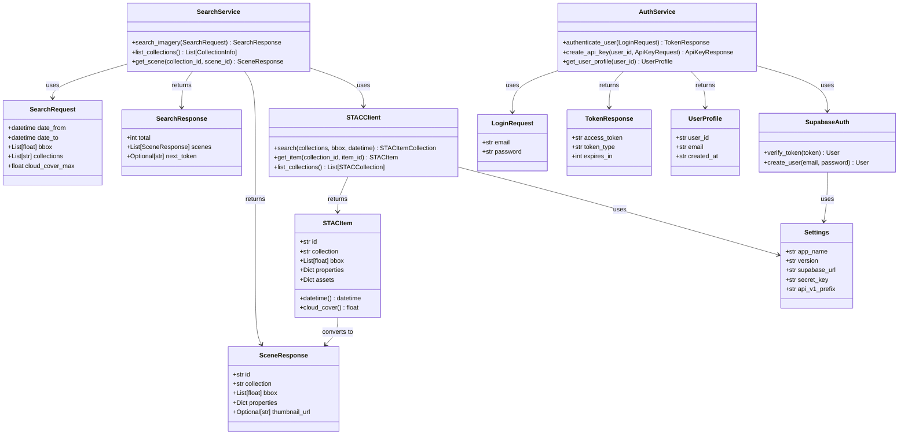

# uml mvp

## Componentes Core del Sistema

### Sistema de Autenticación
- **AuthService**: Servicio principal de autenticación
- **SupabaseAuth**: Integración con Supabase
- **LoginRequest/TokenResponse**: DTOs de autenticación

### Sistema de Imágenes Satelitales
- **SearchService**: Servicio principal de búsqueda
- **STACClient**: Cliente para APIs STAC externas
- **STACItem**: Modelo de escena satelital
- **SearchRequest/SearchResponse**: DTOs de búsqueda

### Configuración
- **Settings**: Configuración centralizada

## Flujo Principal

1. **Autenticación**: Usuario → AuthService → SupabaseAuth → Token
2. **Búsqueda**: Usuario → SearchService → STACClient → STAC APIs
3. **Respuesta**: STACItem → SceneResponse → Usuario

## Patrones de Diseño

- **Service Layer Pattern**: AuthService, SearchService
- **Repository Pattern**: STACClient
- **DTO Pattern**: Request/Response models
- **Singleton Pattern**: Settings, SupabaseAuth
